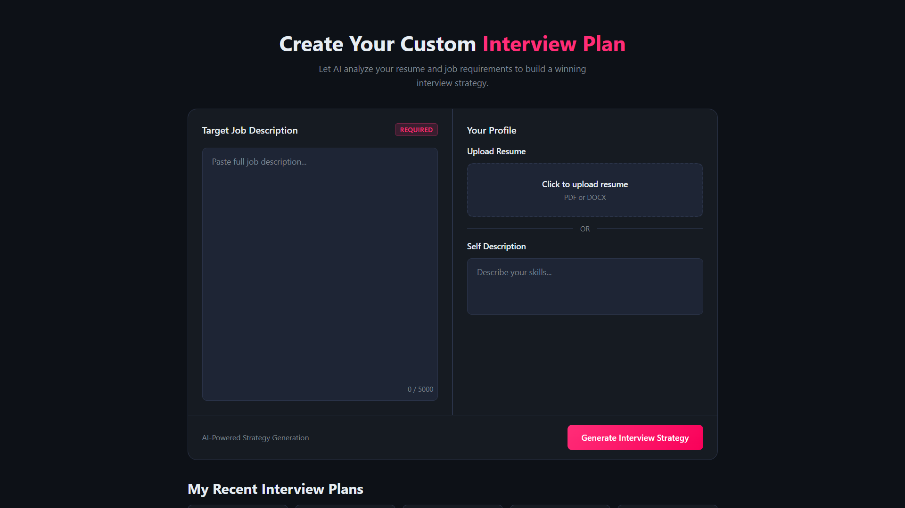
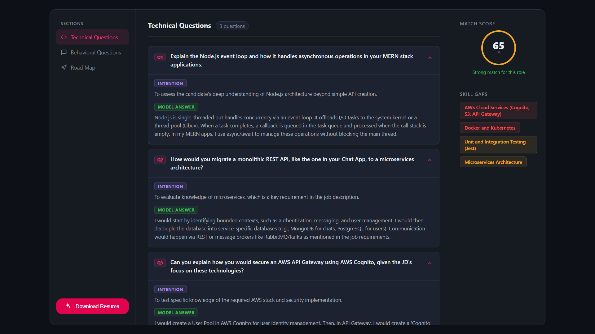
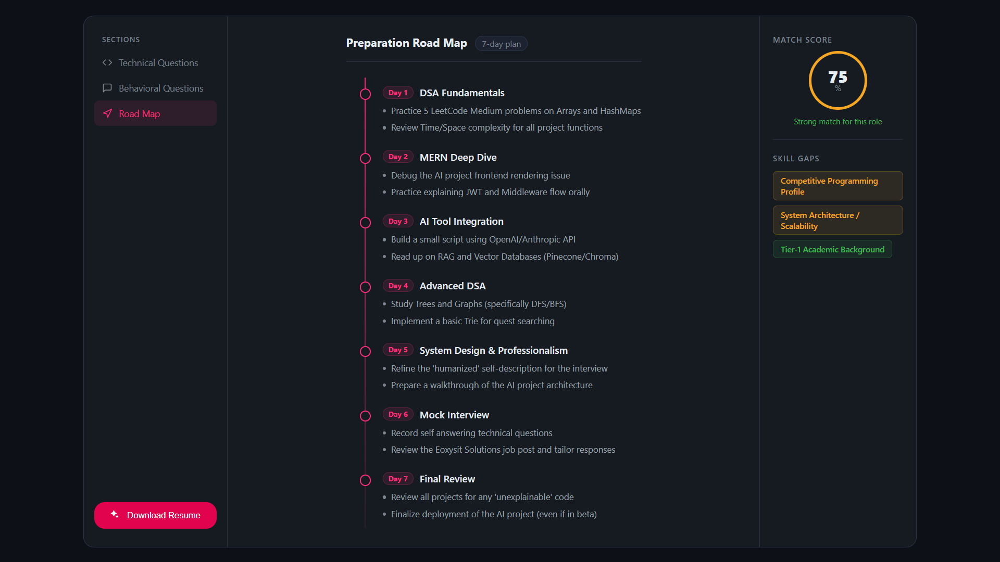

# HireForge AI 🚀

AI-powered interview preparation platform that analyzes resumes and job descriptions to generate personalized interview strategies, technical questions, behavioral questions, skill-gap analysis, and preparation roadmaps using asynchronous AI workflows.

---

# 🌐 Live Demo

Frontend: https://hireforge-ai.vercel.app

Backend API: https://hireforge-ai.onrender.com

---

# ✨ Features

✅ JWT Authentication
✅ Resume Upload & PDF Parsing
✅ AI-Powered Interview Preparation
✅ Technical Questions with AI-Generated Answers
✅ Behavioral Question Generation
✅ Match Score Analysis
✅ Skill Gap Detection
✅ Personalized Preparation Roadmap
✅ Async AI Processing Pipeline
✅ Background Job Processing using BullMQ
✅ Redis Queue System
✅ Resume PDF Download
✅ Responsive Dashboard UI

---

# 📖 Overview

HireForge AI is an AI-powered interview preparation platform designed to help users prepare smarter for technical interviews.

The system analyzes uploaded resumes and job descriptions to generate personalized interview preparation workflows, including technical questions, behavioral questions, skill-gap analysis, preparation roadmaps, and match-score evaluation.

The platform uses asynchronous job processing with BullMQ and Redis to handle AI workloads efficiently without blocking the frontend experience.

---

# 🖼 Screenshots

## Login Page


---

## Home Page



---

## Technical Questions Dashboard



---

## Preparation Roadmap



---

# 🛠 Tech Stack

## Frontend

* React.js
* Vite
* SCSS
* Axios
* React Router

## Backend

* Node.js
* Express.js
* MongoDB
* Mongoose
* JWT Authentication
* Multer
* pdf-parse

## Queue & Background Processing

* BullMQ
* Redis

## AI Integration

* Google Gemini API

---

# 🧠 System Architecture

```text id="g2e2do"
Frontend (React)
      ↓
Express API Server
      ↓
Authentication & Resume Processing
      ↓
BullMQ Queue System
      ↓
Background Worker Service
      ↓
Gemini AI Processing
      ↓
MongoDB Storage
      ↓
Frontend Dashboard Rendering
```

---

# ⚙️ Core Engineering Concepts

* Asynchronous Job Processing
* Queue-Based Architecture
* Background Worker Systems
* AI Workflow Orchestration
* Resume Parsing
* JWT Authentication
* REST API Design
* Scalable Backend Architecture
* Frontend State Management
* AI Response Processing Pipelines

---

# 📂 Project Structure

```text id="nif8jn"
hireforge-ai/
│
├── Backend/
│   ├── src/
│   │   ├── controllers/
│   │   ├── routes/
│   │   ├── models/
│   │   ├── workers/
│   │   ├── queues/
│   │   ├── services/
│   │   └── middlewares/
│
├── Frontend/
│   ├── src/
│   │   ├── features/
│   │   ├── pages/
│   │   ├── services/
│   │   └── styles/
```

---

# 🔄 Workflow

1. User uploads resume and enters job description.
2. Backend extracts resume data using PDF parsing.
3. AI tasks are added to BullMQ queues.
4. Background workers process interview generation requests asynchronously.
5. Gemini AI generates technical questions, behavioral questions, and skill analysis.
6. Results are stored in MongoDB.
7. Frontend dashboard displays personalized interview preparation content.

---

# ⚙️ Environment Variables

## Backend `.env`

```env id="jlwmyl"
PORT=3000

MONGO_URI=your_mongodb_uri

JWT_SECRET=your_jwt_secret

REDIS_URL=your_redis_url

GOOGLE_GENAI_API_KEY=your_gemini_api_key
```

---

# 🚀 Installation

## Clone Repository

```bash id="g08zn7"
git clone https://github.com/prakhar051/hireforge-ai.git

cd hireforge-ai
```

---

# 🔥 Backend Setup

```bash id="yw2s5t"
cd Backend

npm install
```

## Start Backend

```bash id="fh9e7g"
npm run dev
```

---

# ⚡ Start Worker Service

Open another terminal:

```bash id="gcj0a2"
cd Backend

npm run worker
```

---

# 🎨 Frontend Setup

```bash id="8f29zv"
cd Frontend

npm install

npm run dev
```

---

# 🌐 Deployment

## Frontend

* Vercel

## Backend API

* Render Web Service

## Background Worker

* Render Background Worker

## Database

* MongoDB Atlas

## Queue System

* Redis

---

# 📌 Important Notes

* Worker service must run separately for BullMQ jobs.
* Redis is required for queue processing.
* MongoDB Atlas IP must be whitelisted.
* Gemini API key is required for AI generation.
* Frontend depends on backend and worker services for AI processing.

---

# 🚧 Challenges Faced

* Managing asynchronous AI processing workflows using BullMQ and Redis
* Handling large PDF resume parsing efficiently
* Preventing frontend blocking during AI response generation
* Managing worker-service communication and queue reliability
* Debugging deployment issues across frontend, backend, and worker services
* Handling AI response latency and background task management

---

# ⚠️ Current Limitations

* AI response generation depends on external API latency
* Worker service must remain active for queue processing
* Large resumes can increase processing time
* Some AI-generated responses may require manual refinement

---

# 🚀 Production Improvements

* Voice-Based Mock Interviews
* Real-Time Interview Simulation
* ATS Resume Scoring
* AI Resume Builder
* Email Notifications
* Analytics Dashboard
* Multi-Role Interview Generation
* Real-Time Collaboration Features

---

# 📌 Resume Highlights

* Built an AI-powered interview preparation platform using React, Node.js, MongoDB, BullMQ, and Gemini AI.
* Designed asynchronous AI processing workflows using Redis queues and background workers.
* Implemented resume parsing, job-role analysis, technical question generation, and skill-gap evaluation.
* Developed scalable backend APIs with JWT authentication and PDF processing.
* Integrated AI-driven preparation roadmaps, behavioral interviews, and match-score analytics.
* Managed separate frontend, backend, and worker deployments using Vercel and Render.

---

# 💡 Why This Project Matters

Technical interview preparation is often generic and inefficient. HireForge AI was built to provide personalized interview preparation workflows by combining resume analysis, job-role matching, AI-generated technical questions, and skill-gap evaluation into a single platform.

---

# 👨‍💻 Author

## Prakhar Yadav

Full Stack Developer | AI Enthusiast | Backend Developer

GitHub: https://github.com/prakhar051

---

# 📜 License

This project is licensed under the MIT License.
